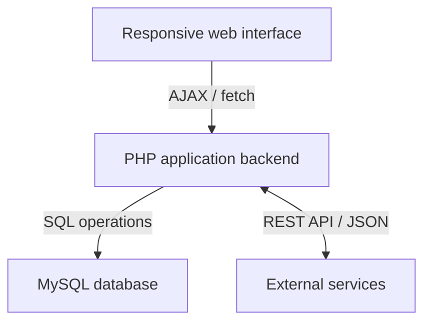

  

<strong>Real business workflows · Responsive interface · Relational data · API integrations</strong>

JavaScript / HTML / CSS &nbsp; · &nbsp; PHP &nbsp; · &nbsp; MySQL / SQL &nbsp; · &nbsp; REST API / JSON

# VIC CRM

A custom web application supporting everyday operations in the medical and cosmetology sector. Built around real business processes, with functionality developed iteratively using user feedback.

**Author:** [Albert Smoliński](https://github.com/AlbertSGit)  
**Documented development period:** May - August 2026  
**Repository scope:** Portfolio documentation. Application source code is not included.

## Business context

Managing clients, appointments, documentation, service series, settlements and tasks involves interconnected workflows. VIC CRM brings these areas into one application and supports access from desktop computers, tablets and mobile devices.

## My contribution

- Designed functionality based on real operational needs and refined it through user feedback.
- Developed the desktop, mobile and tablet interface in JavaScript, HTML and CSS.
- Implemented asynchronous communication and data updates using AJAX and `fetch`.
- Implemented backend logic in PHP and operations on a relational MySQL database.
- Designed integrations and data synchronization using REST API and JSON.

## Functional scope

| Area | Scope described in the project |
| --- | --- |
| Clients | Client records supporting daily operations |
| Appointments | Visit management |
| Documentation | Documentation connected with operational workflows |
| Service series | Management of multiple-service workflows |
| Settlements | Settlement records and related business operations |
| Tasks | Tasks supporting the team's work |
| Integrations | Communication and data synchronization with external services |
| Responsive UI | Desktop, tablet and mobile interfaces |

## Architecture overview

The diagram below is a conceptual overview based on the technologies used. It deliberately omits endpoints, database structure and deployment details.

| Layer | Technologies | Responsibility |
| --- | --- | --- |
| Interface | JavaScript, HTML, CSS | Responsive screens and asynchronous updates |
| Application | PHP | Backend logic and data operations |
| Data | MySQL, SQL | Relational storage |
| Integration | REST API, JSON | External communication and synchronization |

## QA perspective

This project connects application development with my background in software testing. Its linked workflows provide practical examples for discussing data consistency, error handling and regression risk during a technical interview.

The following are **suggested validation areas**, not a claim that an automated test suite or specific coverage level has been delivered:

- Consistency of client and appointment data across related screens.
- Validation of required fields and handling of invalid input.
- Service-series and settlement flows, including repeated user actions.
- Failed asynchronous requests and recovery without displaying stale data.
- Integration failures and synchronization behavior.
- Responsive behavior on desktop, tablet and mobile screens.

## About this repository

This case study describes the application and my implementation scope. It does not expose the source code, production configuration or real client records, and is not intended as evidence of code quality or automated test coverage.

**Albert Smoliński** · [GitHub](https://github.com/AlbertSGit) · [LinkedIn](https://www.linkedin.com/in/AlbertSm12)
